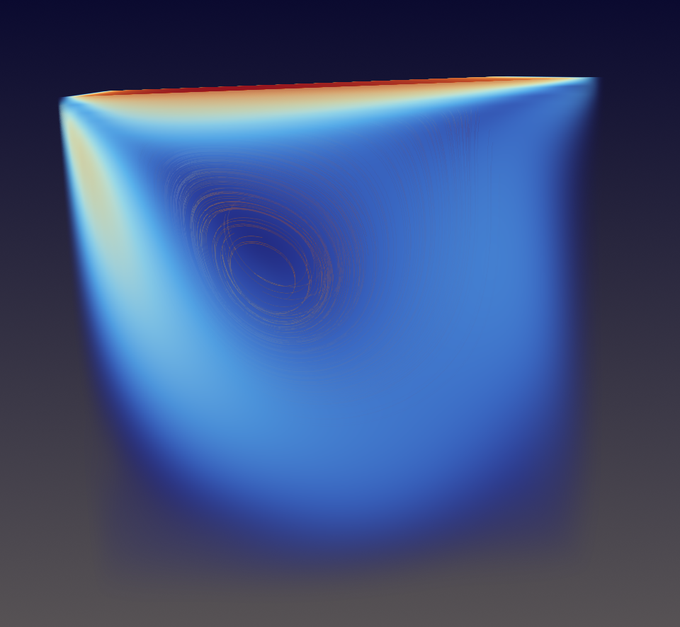
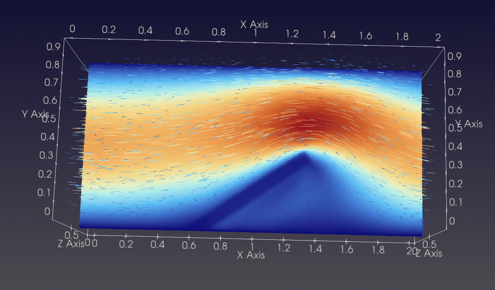
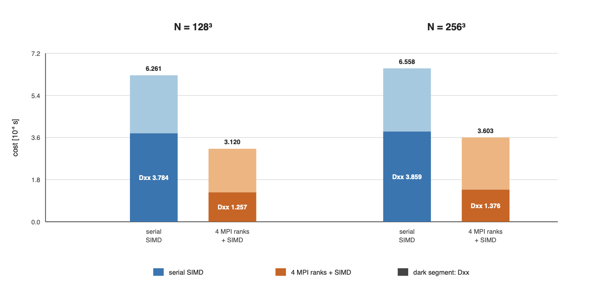

# Navier–Stokes–Brinkman Solver

A three-dimensional finite-difference solver for incompressible flow with
Brinkman penalization.

<p align="center">
  
  &nbsp;
  
</p>

## Mathematical model

On a rectangular domain $\Omega\subset\mathbb{R}^3$, the incompressible
Navier–Stokes–Brinkman equations are

$$
\begin{aligned}
\frac{\partial \mathbf{u}}{\partial t}
+ (\mathbf{u}\cdot\nabla)\mathbf{u}
- \nu\nabla^2\mathbf{u}
+ \nabla p
+ \frac{\nu}{K}\mathbf{u}
&= \mathbf{f},\\
\nabla\cdot\mathbf{u} &= 0.
\end{aligned}
$$

Here $K$ is the permeability. A large value recovers the free-fluid
equations, whereas a small value penalizes the velocity and represents a
solid or porous region without changing the Cartesian mesh.

## Numerical method

The equations are discretized on a uniform staggered Cartesian grid using
second-order centered finite differences. A fractional-step method separates
the momentum update from the pressure correction, following the
direction-splitting formulation of Chiarini, Quadrio, and Auteri [1]. Both
stages use a modified Douglas direction splitting: each three-dimensional
implicit problem is reduced to successive one-dimensional solves in the
$x$, $y$, and $z$ directions. The resulting tridiagonal systems are
solved with the Thomas algorithm.

## Solver implementation

The MPI implementation decomposes the domain over a three-dimensional
Cartesian process grid. Each rank stores a local block with one halo layer on
each face. Tridiagonal lines distributed across ranks are solved with a
batched forward/backward Thomas pipeline; the batch size controls the balance
between communication frequency and pipeline latency. Optional SIMD kernels
process independent lines within each rank, using AVX2 on x86-64 or NEON on
AArch64, selected at compile time.

The performance measurements below were obtained on a MacBook Pro with an
Apple M1 processor, four performance cores, and 8 GB of unified memory, using
double precision, `-O3`, and 128-bit NEON SIMD. The MPI runs used four ranks
on a $2\times2\times1$ Cartesian process grid.




## Branches

- [`main`](https://github.com/EmaSeve/navier-stokes-brinkman-solver/tree/main): MPI-parallel Stokes–Brinkman solver.
- [`serial`](https://github.com/EmaSeve/navier-stokes-brinkman-solver/tree/serial): serial Stokes–Brinkman solver.
- [`convective`](https://github.com/EmaSeve/navier-stokes-brinkman-solver/tree/convective): serial solver with the nonlinear convective term.

## Build and run the MPI version

### Requirements

- a C11 compiler;
- an MPI implementation providing `mpicc` and `mpirun`;
- GNU Make.

Compile and run with:

```sh
make solver SIMD=1 PIPELINE_BATCH_LINES=32
mpirun -np 4 ./solver
```

The numerical grid, domain, final time, and number of time steps are
compile-time parameters defined in `include/solver.h` and can be overridden as:

```sh
make clean
make solver CFLAGS="-std=c11 -O3 -Wall -Wextra -Iinclude \
  -DWIDTH=128 -DHEIGHT=128 -DDEPTH=128 -DT=1.0 -DSTEPS=100"
```

Compile all verification and application programs with `make tests`. For
example:

```sh
make tests
mpirun -np 4 ./build/tests/paper_man
mpirun -np 4 ./build/tests/channel_obstacle
```

## Manufactured-solution verification

Spatial and temporal accuracy are assessed with the method of manufactured
solutions. On $\Omega=(0,\pi)^3$, with $\nu=1$, the analytical fields are

$$
\mathbf{u}(x,y,z,t)=
\begin{pmatrix}
\sin x\,\cos(t+y)\,\sin z\\
\cos x\,\sin(t+y)\,\sin z\\
2\cos x\,\cos(t+y)\,\cos z
\end{pmatrix},
\qquad
p(x,y,z,t)=-3\nu\cos x\,\cos(t+y)\,\cos z,
$$

with the smooth, spatially varying permeability

$$
K(x,y,z)=0.75+0.20\sin x\,\cos y\,\sin z.
$$

The analytical velocity supplies both the initial and Dirichlet boundary
data. The forcing is obtained by substituting these fields into the
non-convective Stokes–Brinkman equation,

$$
\mathbf{f}=
\frac{\partial\mathbf{u}}{\partial t}
-\nu\nabla^2\mathbf{u}
+\nabla p
+\frac{\nu}{K}\mathbf{u}.
$$

The refinement studies approach second-order convergence in both space and
time.


## Reference

The direction-splitting formulation follows the approach described in:

[1] A. Chiarini, M. Quadrio, and F. Auteri, “A direction-splitting Navier–Stokes
solver on co-located grids,” *Journal of Computational Physics*, vol. 429,
110023, 2021.
