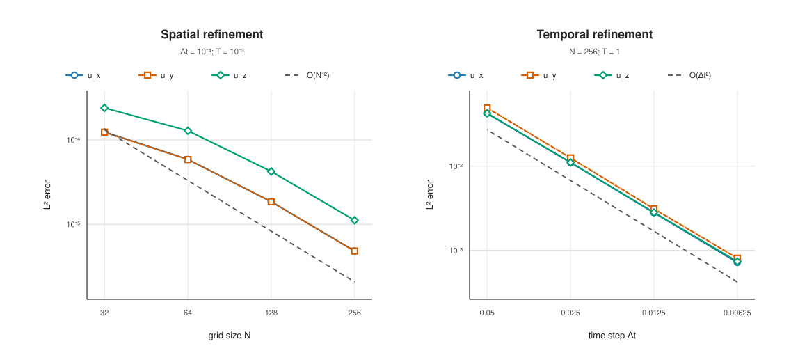
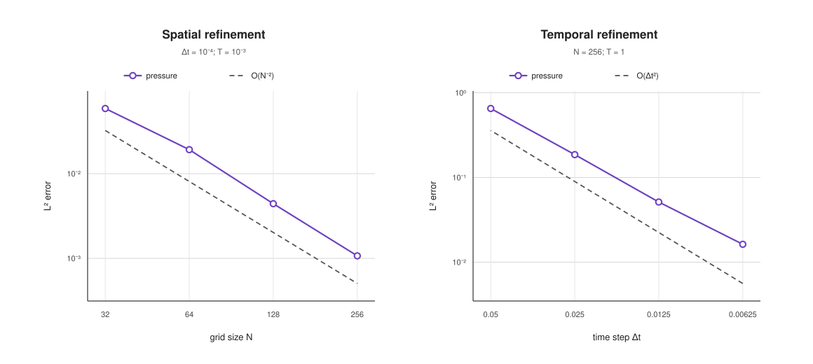
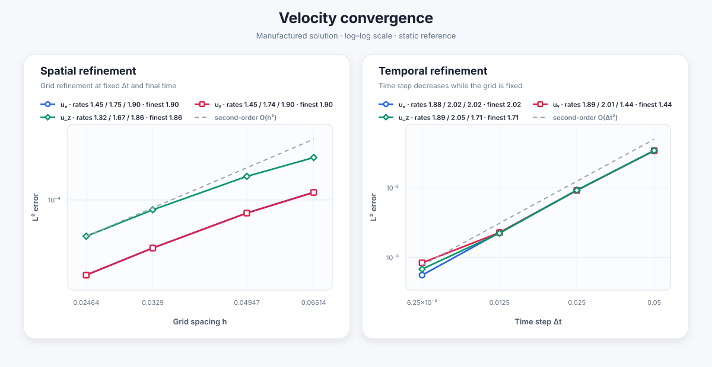
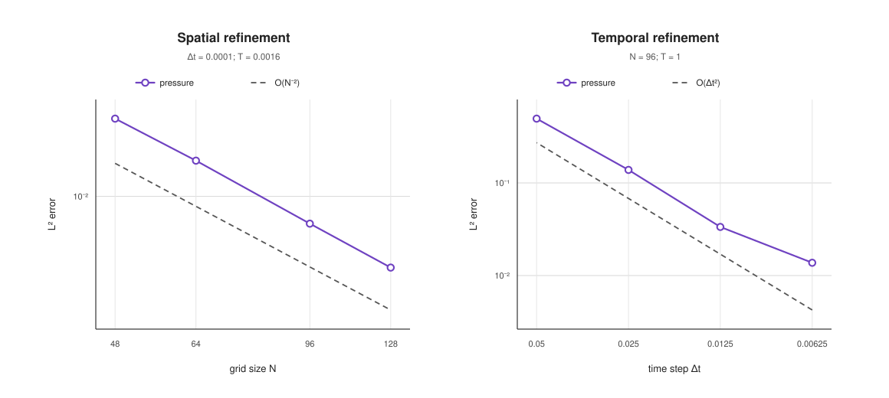
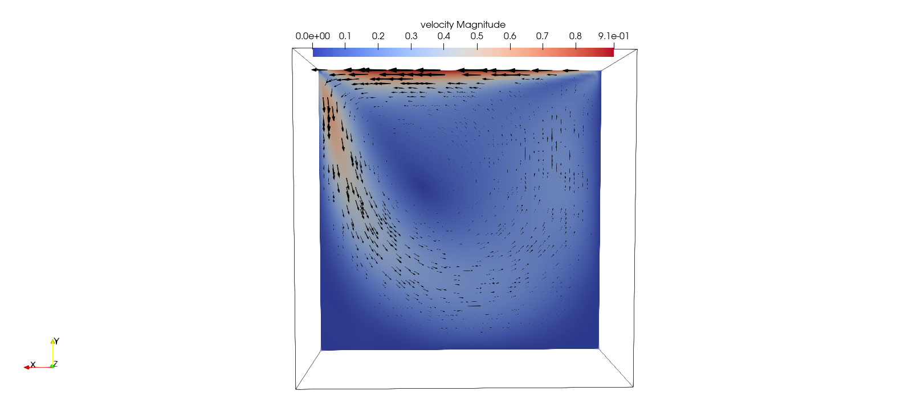
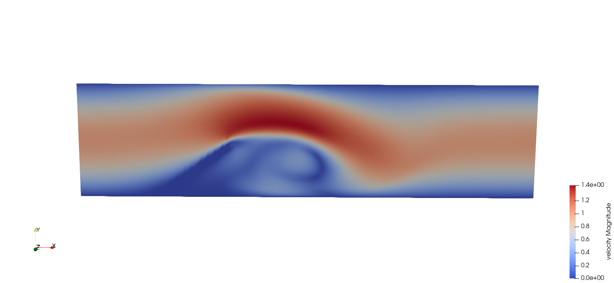

# Navier Stokes Brinkman Equation Solver


## Build

Compile the main `solver` executable:

```sh
make solver
```

Enable the explicit SIMD momentum kernels with independently tunable blocks of SIMD vectors:

```sh
make SIMD=1 ZETA_SIMD_VECTORS=16 U_SIMD_VECTORS=16
```

Compile all tests:

```sh
make tests
```

The test executables are created in `build/tests/` and can be run separately:

```sh
./build/tests/paper_man
./build/tests/constant_forcing_man
./build/tests/convective_forms
./build/tests/paper_convective_man
./build/tests/channel_obstacle
```

The channel case at $Re=400$ has a separate reproducible configuration:

```sh
make build/tests/channel_obstacle_re400
./build/tests/channel_obstacle_re400
```

Its domain, grid, viscosity, permeability, time step, and obstacle position
are recorded in `configs/channel_re400.mk`.


## Solver structure

`solver_init` allocates the numerical fields and initializes them through the
functions stored in `Data`. Then, `solver_solve` advances the solution for
`STEPS` time steps:

```text
solver_init
    |
    v
time-step loop
    |
    +-- momentum_step
    |      +-- extrapolate velocity for explicit convection
    |      +-- eta: solve along X
    |      +-- zeta: solve along Y
    |      +-- u: solve along Z
    |
    +-- pressure_step
           +-- psi
           +-- phi_low
           +-- phi_high
           +-- pressure update
```

The momentum systems are solved one direction at a time with the Thomas
algorithm for tridiagonal matrices. The pressure correction is similarly
factorized into three directional solves. `momentum.c` and `pressure.c`
implement these two stages, while `physics.c`, `field.c`, and `data.c` provide
the physical terms, field utilities, and problem definition.

## Types

`Real` is the scalar type used by every numerical field. It is `double` by
default and becomes `float` when the code is compiled with `-DUSE_FLOAT`.

```text
ScalarField                         VectorField
+------------------+                +------------------+
| Real *v          |                | Real *v_x        |
+------------------+                | Real *v_y        |
                                    | Real *v_z        |
                                    +------------------+
```

The main structures are:

```text
Data
+-- name                      scenario name used for output
+-- bc_velocity()             boundary velocity
+-- forcing_fn()              forcing term
+-- porosity_fn()             porosity field
+-- porosity_time_dependent   boolean
+-- velocity_fn()             initial/exact velocity
+-- pressure_fn()             initial/exact pressure

SolverMemState
+-- eta, zeta, u              ADI velocity fields
+-- u_prev, u_star            velocity history and extrapolated velocity
+-- k                         permeability field
+-- pressure, pressure_star   ScalarField

SolverStats
+-- execution times for the solver stages, stored in nanoseconds
```

Function pointers in `Data` keep the numerical solver independent from a
specific physical test case. `SolverMemState` groups all
fields that must remain available between time steps.

## Memory management

```text
solver_init
    +-- allocate persistent fields
        +-- 6 VectorField = 18 full-grid arrays
        +-- 2 ScalarField =  2 full-grid arrays

solver_solve
    +-- allocate pressure_buffer   1 full-grid temporary array
    +-- allocate rhs and tmp       2 reusable line/block buffers
    +-- run all time steps
    +-- free pressure_buffer, rhs, and tmp
```
## Convergence study

Run the spatial and temporal convergence tests:

```sh
./scripts/run_convergence.sh
```

Errors and convergence rates are written to `build/convergence/results.csv`.





## Nonlinear convection

The momentum equation includes the nonlinear term in skew-symmetric form,

```text
C(u) = 1/2 [(u . grad)u + div(u tensor u)].
```

The advective and divergence forms are discretized separately on the
staggered grid and added in `convective_term`. Values required at upper
boundaries are reconstructed from the prescribed Dirichlet data using ghost
points.

Convection is advanced explicitly. At each time step, the velocity at the
intermediate time level is extrapolated from the two previous solutions,

```text
u* = 3/2 u^n - 1/2 u^(n-1),
```

and `convective_term` is evaluated using `u*`. Diffusion remains implicit and
is handled by the three directional ADI solves in `momentum_step`.

The discrete convective forms and the temporal extrapolation are checked by
`convective_forms`. A manufactured solution containing nonlinear convection
is provided by `paper_convective_man`. Its spatial and temporal convergence
studies can be reproduced with:

```sh
./scripts/run_convective_convergence.sh
```

The errors and observed rates are written to
`build/convective_convergence/results.csv`.





## Numerical applications

### Lid-driven cavity

The three-dimensional lid-driven cavity is simulated at $Re=400$ on a
$64^3$ grid. The figure shows the velocity magnitude and velocity vectors on
a central section at the final time $T=20$.



### Channel with an inclined Brinkman obstacle

The channel case is simulated at $Re=400$ using Brinkman penalization for the
inclined wall-attached obstacle. The figure shows the velocity magnitude on a
central spanwise section at the final time $T=6$.

